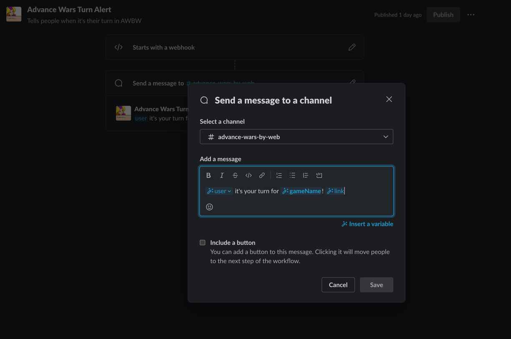

# Advance Wars Slack Notifier

Copy `config.example.js` to `config.js`

Information on creating Slack webhook url can be found
here: https://slack.com/help/articles/360041352714-Create-workflows-that-start-with-a-webhook

In general, create a webhook triggered workflow that receives `user`, `gameName`, and `link` and then display that
information how you'd like where you'd like.



`userMappings` have to be configured manually, this is just a mapping of someone's AWBW username to their slack email so
they can be directly notified.

`gameMappings` is an array for each game you want to track and notify on. Each game gives a user a unique player ID
which
needs to be mapped to their username so you have to do this for every game. Pasting this snippet in the console of the
game you want to track
will generate the object for you:

```js
const gameTitle = document.querySelector('.game-header-header a').textContent;

const gameMapping = Object.keys(playersInfo).reduce((acc, playerId) => {
    const username = playersInfo[playerId].users_username;
    acc[playerId] = username;
    return acc;
}, {});

gameMapping['name'] = gameTitle;

console.log(`'${gameId}':`, JSON.stringify(gameMapping, null, 4));
```

## Future Ideas

A lot of the config could be generated automatically with some scrapers. Ideally could add some commands or even a DB
to easily track new games and automatically remove completed games. Could be a slack application too dont from slack
commands.

The way this taps into the websocket though could be inefficient for AWBW servers (since it is monitoring the whole
game) so might be worth
working with AWBW devs to get an endpoint to more easily get this information.